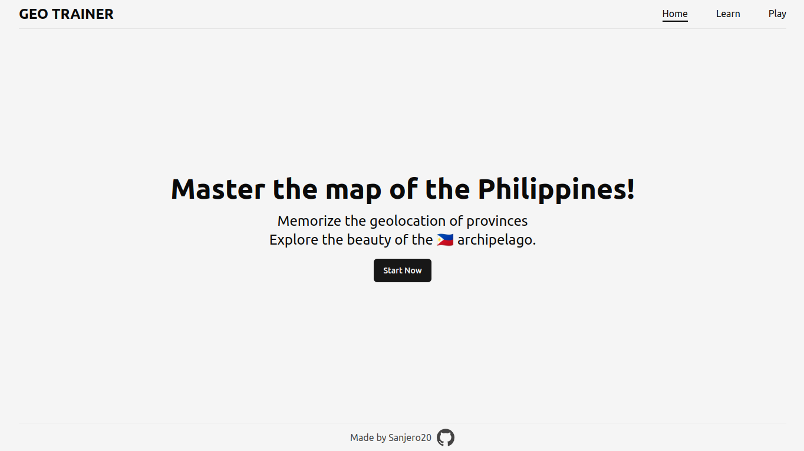
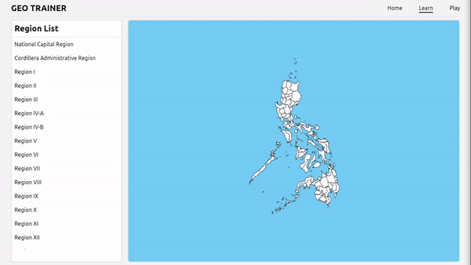
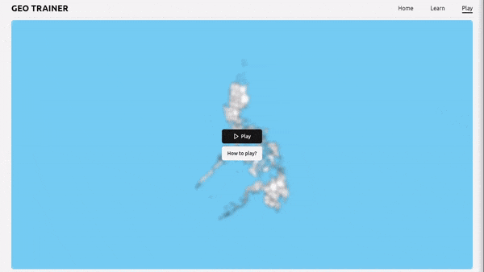

<div align="center">
  <h1> Geo Trainer 🇵🇭📌 </h1>
  <p>A website to master and memorize the map of the Philippines</p>
</div>

## Demo

### Home page



### Learn page



### Play page



## Features

- [x] Zoom functionality for detailed map exploration
- [x] Highlight specific province
- [x] Highlight map by region
- [x] Display tooltip on hover
- [x] Game timer

## Getting Started

Follow these instructions to get a copy of the project up and running on your local machine.

### Prerequisites

- Node.js
- Git

### Installation

```bash
git clone https://github.com/Sanjero20/geo-trainer.git
cd geo-trainer
npm install
```

### Usage

```bash
npm build && npm start
```

## License

This project is licensed under the MIT License - see the [LICENSE](./LICENSE) file for details.
